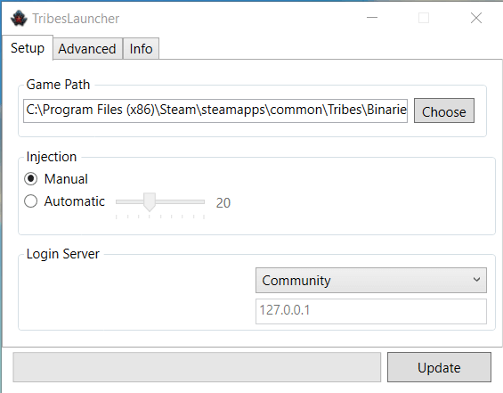
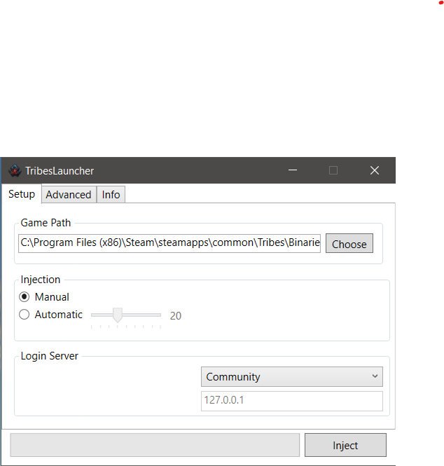
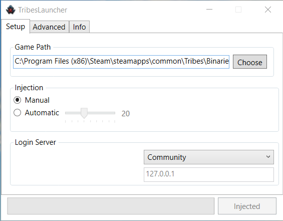
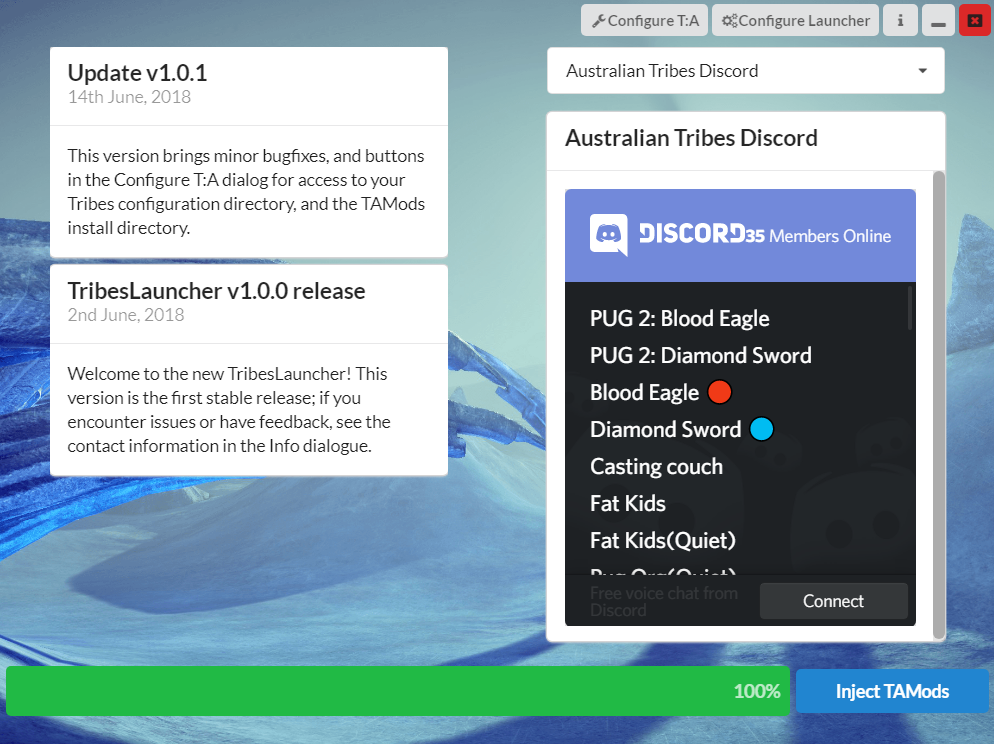
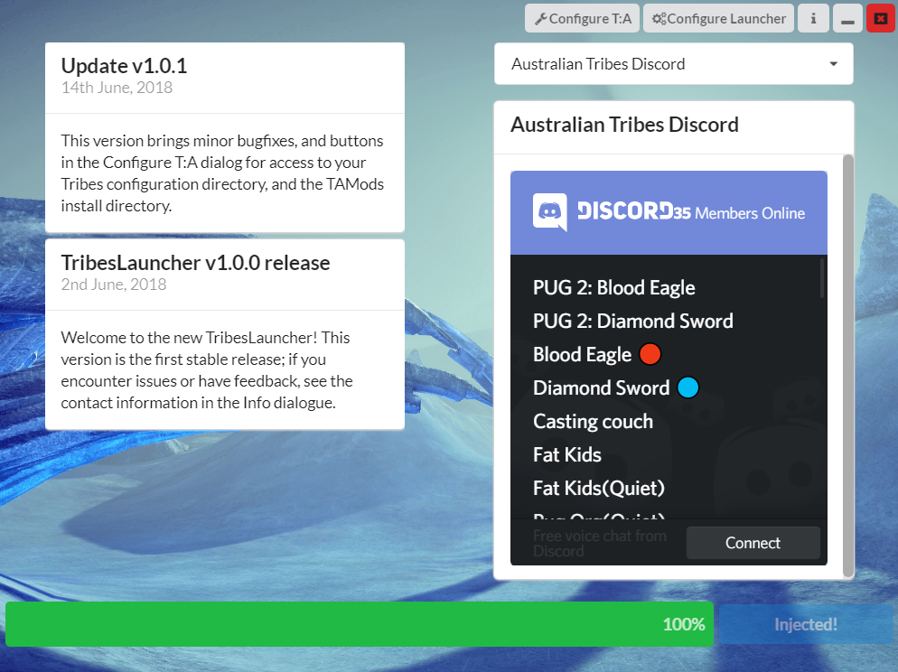

TAMods is an unofficial modding framework for Tribes: Ascend which allows you to customise nearly every aspect of the game experience. You can customise your UI and the graphical look of your game, modify game hitsounds, record capping routes and view them via a UI guide or via a bot replay, and much more via built-in custom options and via Lua scripting.

TAMods does _not_ allow any gameplay-affecting changes, so that players using TAMods have no in-game advantage over those who do not.

## Getting TAMods

### Getting the launcher

The recommended way to get started with TAMods is to download [TribesLauncher here](https://github.com/mcoot/TribesLauncherSharp/releases). TribesLauncher is an application which automatically keeps TAMods up-to-date, and allows you to run Tribes with TAMods enabled.

Extract the downloaded zip file; from here, you can run the `TribesLauncherSharp` application. The first screen you see should look something like:



Ensure that the `Game Path` box has the correct path to your Tribes executable. This will most commonly be either in your Steam folder (something like `C:\Program Files (x86)\Steam\SteamApps\Common\Tribes\Binaries\Win32\TribesAscend.exe`) or in the HiRez install directory (something like `C:\Program Files (x86)\HiRez Studios\HiRezGames\Tribes Ascend\Binaries\Win32\TribesAscend.exe`).

### Installing TAMods

The button in the bottom right will prompt you to `Update` TAMods, which will perform the installation. Once the installation finishes, the button text will change to `Launch`.


From here you are ready to use TAMods!

### Configuration

On first start, the launcher will offer to enable the Ubermenu preset, which will allow you to configure TAMods from within Tribes itself, by pressing `F1` during a game. If desired, you can enable the Auto-Inject feature on the main screen to automatically load TAMods once the game has started.

Above the `Launch` button, a drop down selector will allow you to choose which Tribes login server you wish to connect to. Choosing `HiRez` will log you into the official servers, while choosing `Community` will instead log you into the community-hosted login server allowing access to custom and modded games.

### Running the game with TAMods

On the main screen, press `Launch`; the game should start. Log into Tribes as per usual. Once on the main menu, if you did not enable Auto-Inject, you will have to alt-tab out of the game to perform injection.



The bottom-right button should now say `Inject`. After pressing it, you should hear the Blue Plate Special sound, and the button should become greyed out and say `Injected`. This indicates that injection has been successful. If you see an error message, see [below](#what-to-do-if-injection-fails) for troubleshooting steps.



To check that the injection has worked correctly, enter a server in-game (Roam Map mode is fine). Then, open the T:A console. Note that a bug in Tribes causes the `~` key to open the Unreal Engine console rather than the T:A one; you may need to change your keybinding in the menus, under `Settings > Keybindings > Interface > Chat Console` to a different key.

Once you've opened the T:A console, it should appear semi-transparent; if you scroll down you should see ASCII art indicating that TAMods is running. If you see this, it has installed correctly. If not, see [below](#what-to-do-if-injection-succeeds-but-tamods-isn-t-working) for troubleshooting steps.



While still in a server, hit the `F1` key. You should see a menu appear on the left-hand side of the screen, which can be controlled with the arrow keys. This is the Ubermenu and will allow you to configure many TAMods settings in-game. If you don't see this, see [below](#what-to-do-if-injection-succeeds-but-tamods-isn-t-working) for troubleshooting steps.



### Success!

If you've followed to this point, you now have TAMods installed and working! You can hit `F1` to access the Ubermenu whenever you're in a server, and customise most TAMods features in-game. A few additional settings are available in the external configuration tool, which will be installed into a `config` directory alongside the launcher.

## Troubleshooting

### Contact

For help with TAMods related issues, please contact one of the TAMods developers. This can be done via the [Australian Tribes discord](https://discord.gg/ySkx6Cg), or by messaging /u/avianistheterm (mcoot) or /u/dodgesabre (dodge) on Reddit.

### What to do if injection fails

If injection fails, there are a number of possible common causes.

1. Ensure the game is running
2. In the Launcher Configuration panel, ensure that the path to the game binary is correct, and that the path to TAMods.dll is correct
3. Make sure you have all Microsoft Visual C++ redistributables installed. These can be found [here](https://support.microsoft.com/en-au/help/2977003/the-latest-supported-visual-c-downloads)

### What to do if injection succeeds but TAMods isn't working

#### I can't see the TAMods logo in the console

If you don't see an error message and you hear the blue plate sound, but TAMods features do not work, check the following potential causes:

1. Make sure you have all Microsoft Visual C++ redistributables installed. These can be found [here](https://support.microsoft.com/en-au/help/2977003/the-latest-supported-visual-c-downloads)
2. If you have changed your configuration, try reloading it in game with `/rc`; if this shows Lua errors then there is an error in your configuration or custom scripts

#### I can see the logo in the console, but pressing F1 does not show the Ubermenu

This indicates that the Ubermenu preset is not loaded. Re-opening the launcher _should_ prompt you to add it. If it does not, you can add it manually by doing the following:

In the launcher, go to the `Advanced` tab and click `Open Config Directory`. The folder that opens should have a `config.lua` file in it. Open this file in a text editor and add the following lines:

```lua
----------------------------------------
---------Required Preset Configs--------
----------------------------------------
require("presets/ubermenu/preset")
```